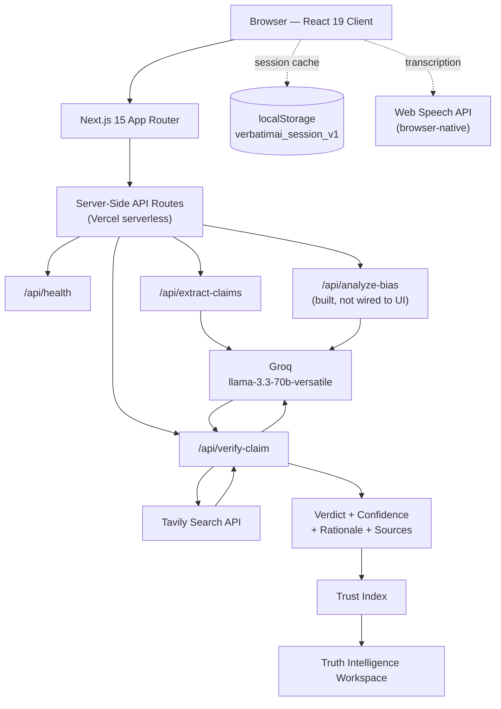
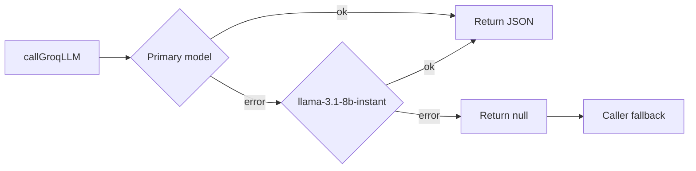
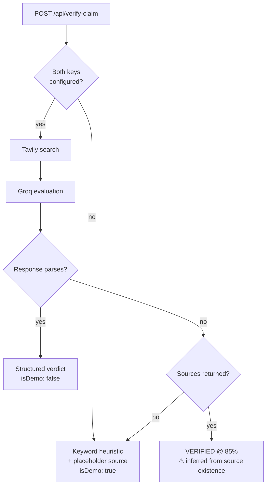
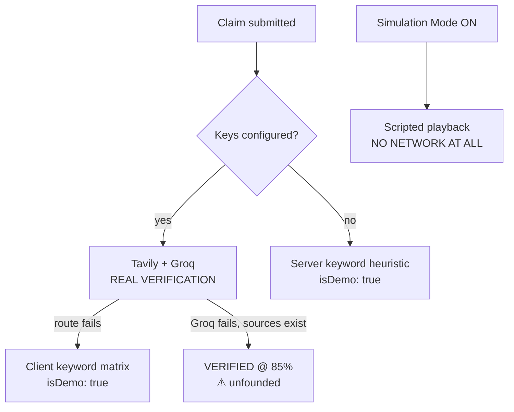
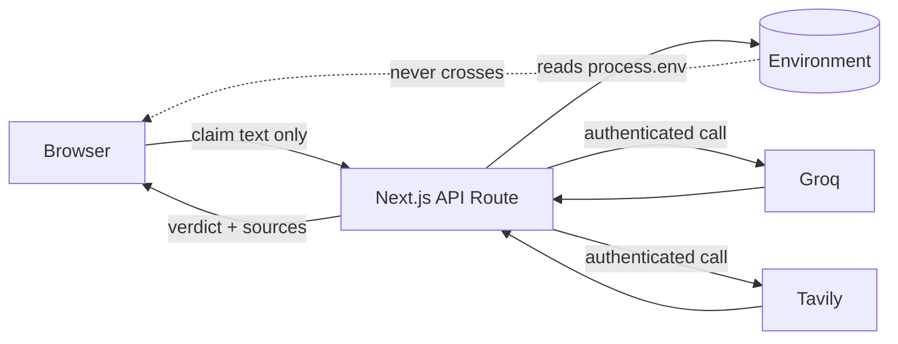
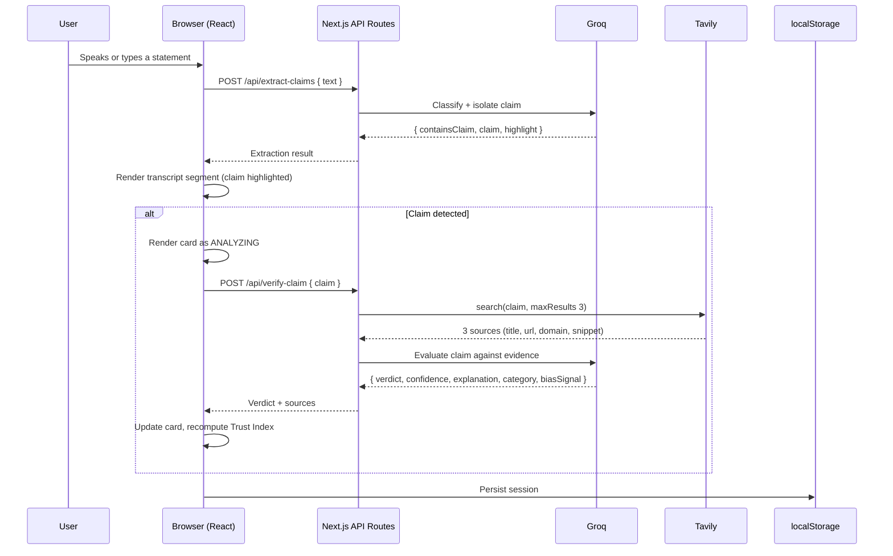
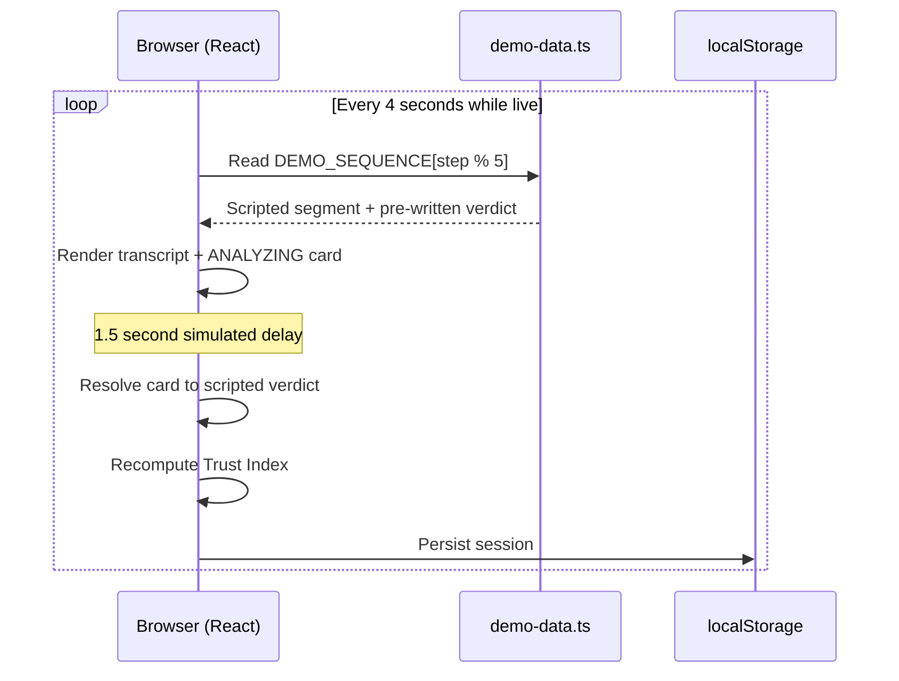
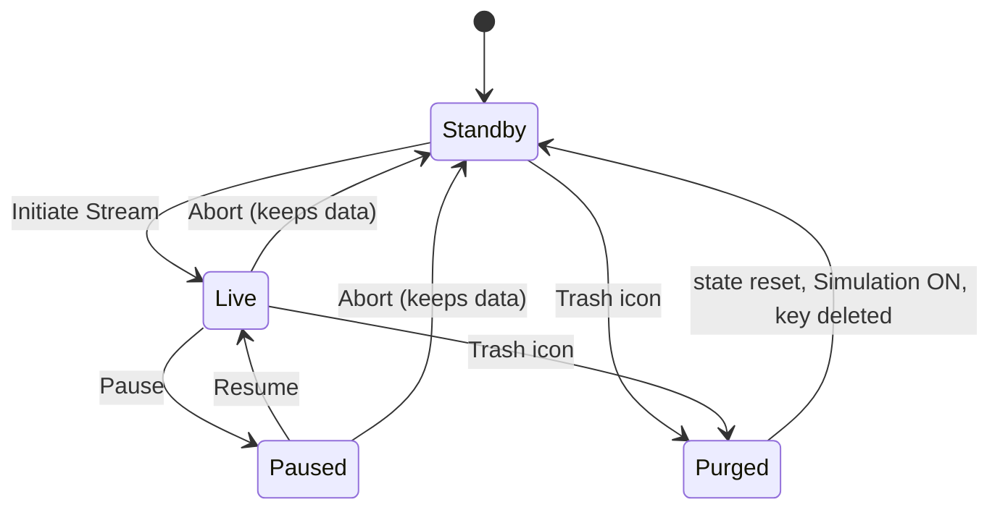

# VerbatimAI — Technical Architecture

System design of the code-frozen production release.

**Stack:** Next.js 15.1 (App Router) · React 19 · TypeScript 5 · Tailwind CSS v4 · Groq SDK · Tavily Core · Vercel

> **Stated up front:** VerbatimAI is a **full-stack Next.js application**. There is no Python backend, no FastAPI service, and no separate API server. The server-side layer is Next.js Route Handlers deployed as serverless functions on Vercel.

---

## Contents

1. [Architecture Overview](#1-architecture-overview)
2. [Frontend](#2-frontend)
3. [Server-Side API Layer](#3-server-side-api-layer)
4. [Speech Recognition](#4-speech-recognition)
5. [Claim Extraction](#5-claim-extraction)
6. [Tavily Evidence Retrieval](#6-tavily-evidence-retrieval)
7. [Groq Reasoning](#7-groq-reasoning)
8. [Verdict Generation](#8-verdict-generation)
9. [Trust Index](#9-trust-index)
10. [Evidence Graph](#10-evidence-graph)
11. [Fallback Architecture](#11-fallback-architecture)
12. [Session Persistence](#12-session-persistence)
13. [Security Model](#13-security-model)
14. [Deployment Architecture](#14-deployment-architecture)
15. [Data Flow](#15-data-flow)

---

## 1. Architecture Overview



### Design principles

**One deployment.** Front end and server-side code ship together. No CORS, no service discovery, no second host that can be down independently.

**Credentials never cross the client boundary.** API keys are read only inside route handlers. The entire reason the server-side layer exists is to hold them.

**Stateless server, stateful client.** Route handlers store nothing. All session state lives in the browser and its localStorage. Any serverless instance can serve any request.

**Degrade, never break.** Every external dependency has a fallback path. The application always renders a coherent interface, even with no keys, no network, and no microphone.

**Retrieval before reasoning.** The LLM never judges from memory. Evidence is retrieved first and passed in as the thing to reason over.

---

## 2. Frontend

### Component tree

```
src/app/layout.tsx          Root layout, metadata, global styles
└── src/app/page.tsx        Dashboard — single client component, all state
    ├── Sidebar.tsx             10-destination navigation
    ├── Header.tsx              Status pills, session controls, Simulation toggle
    └── (active workspace)
        ├── TranscriptPanel.tsx     Transcript stream, mic control, manual input
        ├── TrustFeed.tsx           Trust orb, pipeline stepper, filters, cards
        │   ├── TrustScoreWidget.tsx    Animated score orb
        │   └── ClaimCard.tsx           Individual claim card
        ├── EvidenceAssistant.tsx   Selected-claim detail
        └── NavigationViews.tsx     ClaimsCatalog · EvidenceNodes · BiasAnalysis
                                    HistoryArchive · SessionReports · Settings
                                    HelpSupport
```

### State ownership

All application state is held in `page.tsx` and passed down as props. There is **no Redux, Zustand, or Context** — the tree is shallow enough that prop drilling is the simpler choice.

| State | Purpose |
|---|---|
| `isLive`, `isPaused` | Session lifecycle |
| `isDemoMode` | Simulation toggle — **initialises to `true`** |
| `liveVerificationAvailable` | From `/api/health` on mount |
| `transcript` | Ordered transcript segments |
| `claims` | Claim results, newest first |
| `selectedClaim` | Drives the Evidence Assistant |
| `durationSeconds` | Session timer |
| `isMicActive` | Speech recognition state |
| `currentView` | Active workspace |

Two refs hold non-rendering state: `demoStepRef` (scripted sequence position) and `recognitionRef` (the `SpeechRecognition` instance).

### Routing

**There is exactly one page route.** All ten workspaces render conditionally from `currentView`. Changing views pushes a `?view=` query parameter via `history.pushState`, and a `popstate` listener syncs state back — so browser Back and Forward work without any of the workspaces being real routes.

Trade-off: no code splitting per workspace (the whole app is one 22 kB page bundle, 125 kB first load), but instant view switching with zero navigation latency.

### Effects in `page.tsx`

| Effect | Trigger | Behaviour |
|---|---|---|
| Session restore | Mount | Read localStorage, validate, restore, show toast |
| Popstate sync | Mount | Bind browser history to `currentView` |
| Session save | Any session state change | Serialise to localStorage |
| Health check | Mount | `GET /api/health` |
| Escape key | Mount | Clear the selected claim |
| Duration timer | `isLive`, `isPaused` | 1-second tick while running |
| Demo controller | `isDemoMode`, `isLive`, `isPaused` | 4-second scripted statement interval |

### Styling

Tailwind CSS v4 with a dark "mission control" theme. Custom CSS variables and keyframe animations live in `globals.css`. Icons are `lucide-react`. All visual effects are CSS and inline SVG — no animation or charting library is used anywhere in the application.

---

## 3. Server-Side API Layer

Four Route Handlers under `src/app/api/`. All are dynamic (server-rendered on demand); none are cached or statically generated.

### `GET /api/health`

```json
{ "status": "ok", "live_verification": "available" }
```

Reports whether **both** `GROQ_API_KEY` and `TAVILY_API_KEY` are present. One key alone yields `"unavailable"`.

It checks for key *presence*, not provider reachability — a valid-looking but revoked key still reports `available`. The route carries an explicit comment prohibiting exposure of key values or raw environment data.

### `POST /api/extract-claims`

**In:** `{ text: string }` · **Out:** `{ containsClaim, claim, type, category, confidence, highlight }`

Groq classifies the text and isolates the assertion. Falls back to a regex heuristic when Groq is unconfigured or fails.

### `POST /api/verify-claim`

**In:** `{ claim: string, context?: string }` · **Out:** `{ claim, verdict, confidence, explanation, category, biasSignal?, sources[], isDemo }`

The core route. Tavily search → Groq evaluation → structured verdict.

> The route accepts an optional `context` field, but the client never sends one. It's a forward-compatible hook for passing surrounding conversation into the prompt.

### `POST /api/analyze-bias`

**In:** `{ text: string }` · **Out:** `{ hasBiasSignal, biasType, explanation, severity }`

Fully implemented with both a Groq path and an absolute-language heuristic path (`always`, `never`, `completely`, `everyone`, `nobody`, `100%`, `0%`).

**This route is not called from anywhere in the UI.** The bias signals that appear on claim cards come from the `biasSignal` field of the `/api/verify-claim` response, or from the scripted demo data. The endpoint is a working capability awaiting an interface.

### Shared libraries

`src/lib/groq.ts` — client initialisation, `isGroqConfigured()`, `callGroqLLM()` with model fallback
`src/lib/tavily.ts` — `isTavilyConfigured()`, `searchWebEvidence()` with normalisation
`src/types/index.ts` — `ClaimVerdict`, `EvidenceSource`, `Claim`, `TranscriptSegment`, `SessionStats`, `HealthResponse`

All error handling is defensive: every external call is wrapped, and failures return `null` or an empty array rather than throwing.

---

## 4. Speech Recognition

Browser-native **Web Speech API**, accessed as `window.SpeechRecognition || window.webkitSpeechRecognition`.

```js
recognition.continuous     = true
recognition.interimResults = false   // only committed results
recognition.lang           = 'en-US'
```

**Flow:** microphone → browser speech engine → final transcript text → `handleAddTranscriptSegment(text, 'SPEAKER (LIVE MIC)')` → the standard verification pipeline.

**Handlers:**
- `onresult` — commits final results only; interim results are discarded to avoid verifying half-sentences
- `onerror` — logs and deactivates the mic state cleanly
- `onend` — restarts recognition if the mic is still meant to be active, working around Chrome's automatic session timeouts

**Architecturally important:** **no audio ever reaches VerbatimAI's servers.** The browser performs transcription (in Chrome, typically via Google's speech infrastructure) and hands back text. VerbatimAI receives only that text.

**Constraints:** Chromium-only in practice; requires HTTPS in production; single-language (`en-US`); the `SPEAKER (LIVE MIC)` label is fixed — there is no speaker diarisation.

**Availability gating:** the mic control is hidden entirely while Simulation Mode is ON, and the **Settings** workspace reports whether the API exists in the current browser.

---

## 5. Claim Extraction

### Purpose

Filter conversational noise before spending a web search and an LLM call on it. Greetings, questions, and casual remarks should never reach verification.

### Groq path

System prompt constrains output to a fixed JSON schema and instructs the model to extract only specific, concrete factual or opinion statements. `type` is one of `factual | opinion | casual`; `category` is one of Science, Technology, Statistics, History, Opinion, General.

The `highlight` field returns the exact span of the claim within the original text, which the transcript panel renders as a cyan highlight inside the segment.

### Heuristic fallback

When Groq is unconfigured or its response can't be parsed:

```js
numberRegex = /\b\d+(\.\d+)?%?\b|increased|decreased|invented|
               doubled|tripled|billion|million|percent/i
containsClaim = numberRegex.test(text) || text.length > 20
```

**Substantially cruder.** The `text.length > 20` condition means most substantive sentences are treated as claims. Type classification degrades to keyword matching on *opinion*, *think*, *believe*.

### Client-side last resort

If the fetch itself throws, `page.tsx` falls back to `hasClaim = text.length > 15` and passes the raw text straight through as the claim.

---

## 6. Tavily Evidence Retrieval

```js
tvly.search(query, {
  searchDepth: 'basic',
  maxResults: 3,
  includeAnswer: false
})
```

`includeAnswer: false` is deliberate — we want **documents to reason over**, not a pre-computed answer. Handing the LLM someone else's conclusion would defeat the point of independent evaluation.

### Normalisation

Each result becomes an `EvidenceSource`:

| Field | Source |
|---|---|
| `title` | Result title, falling back to the domain |
| `url` | Result URL |
| `domain` | Parsed hostname with `www.` stripped; `'web'` if parsing fails |
| `snippet` | `content` or `snippet`, truncated to **200 characters** + `...` |

The same objects serve two purposes: they go into the Groq prompt as evidence, and they render in the UI as citations. One shape, no divergence between what the model saw and what the user is shown.

### Failure behaviour

Errors are caught and an **empty array** is returned — never a throw. Verification then proceeds with zero evidence, and the claim card renders `NO CITES`.

### Known constraints

Three sources at basic depth is shallow coverage. 200-character snippets mean the model reads excerpts rather than documents. And **there is no source-credibility weighting** — a personal blog and a government statistics agency enter the prompt with identical standing.

---

## 7. Groq Reasoning

### Client configuration

```js
model:           process.env.GROQ_MODEL || 'llama-3.3-70b-versatile'
response_format: { type: 'json_object' }
temperature:     0.1
```

`json_object` guarantees parseable structured output. `temperature: 0.1` makes verdicts near-deterministic — the same claim with the same evidence produces the same result. Consistency, not creativity.

### Model fallback

On any error from the primary model, the client automatically retries once with `llama-3.1-8b-instant`. If that also fails, `callGroqLLM` returns `null` and the caller's own fallback engages.



### Why Groq

Latency. Every verification carries **two sequential LLM calls** — extraction, then evaluation — plus a web search. Real-time only holds if inference is fast. On slower inference this becomes a different, less useful product.

---

## 8. Verdict Generation

### The evaluation prompt

The system prompt establishes the model as VerbatimAI's Fact Verification Engine, constrains output to five verdicts (`VERIFIED`, `MISLEADING`, `FALSE`, `UNVERIFIED`, `OPINION`), and requires this schema:

```json
{
  "verdict": "VERIFIED | MISLEADING | FALSE | UNVERIFIED | OPINION",
  "confidence": 1-100,
  "explanation": "2-3 concise sentences based on evidence",
  "category": "Science | Technology | Statistics | History | Opinion | General",
  "biasSignal": "short description if rhetorical bias detected, else empty"
}
```

The user prompt carries the claim, the optional context, and the retrieved sources serialised as JSON.

### Decision path



### The parse-failure path

Node **H** above is a genuine correctness gap and is documented as such throughout this repository.

If Tavily returns results but the Groq response cannot be parsed, the route returns `VERIFIED` at 85% confidence — a verdict inferred from the *existence* of search results rather than their content. Search results existing does not mean they support the claim; they might contradict it.

**Correct behaviour:** return `UNVERIFIED` when the reasoning layer is unavailable. This is a small, well-understood fix, deferred only by the code freeze.

### Bias signals

`biasSignal` is populated by the evaluation model when it detects rhetorical framing — *Absolutist Language*, *False Certainty*, *Unsupported Generalization*, *Cherry-Picked Metric*. It renders as an amber alert in the Evidence Assistant and increments the Bias Signals counter on the Trust orb.

Note that this comes from the **verify-claim** response, not from `/api/analyze-bias`, which is unwired.

---

## 9. Trust Index

Computed client-side on every render in `calculateStats()`:

```js
sessionTrustScore = 100

if (totalClaims > 0) {
  penalty = misleadingCount * 12
          + falseCount      * 25
          + unverifiedCount * 5

  sessionTrustScore = clamp(
    Math.round(100 - (penalty / totalClaims) * 1.5),
    10, 100
  )
}
```

`unverifiedCount` includes claims with verdict `UNVERIFIED` **and** `ANALYZING`.

### Properties

- **Averaged, not accumulated** — measures the *rate* of unreliable claims, so long accurate conversations aren't penalised for length and verified claims restore the score
- **OPINION and VERIFIED carry zero penalty** — opinions are deliberately excluded so speculation doesn't degrade the score, a decision surfaced in the Bias Analysis footnote
- **FALSE is roughly 2× MISLEADING** — fabrication weighted above distortion
- **Floor of 10** — no meaningless absolute zero
- **Transient dip during verification** — `ANALYZING` claims carry the UNVERIFIED penalty until they resolve

Thresholds: ≥80 Stable · 60–79 Warning · <60 Critical.

**Honest note:** these weights are reasoned heuristics, not empirically calibrated against human fact-checker judgements.

### Known inconsistency

`HistoryArchiveView` recomputes the score with its own inline expression that **omits the UNVERIFIED penalty and does not round**. It can display a long decimal and differ slightly from the live score. Cosmetic, but visible, and it should be refactored to share `calculateStats()`.

### Derived metrics

| Metric | Formula | Where |
|---|---|---|
| Dialogue Fact Density | `(total − opinions) / total` | Bias Analysis |
| Factual Correction Ratio | `(false + misleading) / total` | Bias Analysis |
| Average Confidence | mean of all `confidence` values | `SessionStats` (computed, not surfaced in the UI) |
| Bias Signals | count of claims with a `biasSignal` | Trust orb |

---

## 10. Evidence Graph

Evidence is presented in two workspaces, and it's worth being precise about which parts are data-driven.

### Evidence Nodes workspace

A master-detail layout: selectable list of claims that carry sources (left), and for the selected claim its statement, a node-graph panel, and full source details (right).

**Data-driven:** the claim list, the source count in *"Verified against N index nodes"*, and every entry in Node Details — title, domain badge, snippet, external link.

**Not data-driven:** the graph illustration itself. It is a **fixed two-icon schematic** joined by an animated dashed line. It does not render one node per source and its shape does not vary with the data.

### Evidence Assistant — Relational Audit Map

An inline SVG showing `ASSERT` → `SRC 01` / `SRC 02` → `VERDICT` with animated flow paths.

**Data-driven:** the verdict node's colour maps to the actual verdict.

**Not data-driven:** the topology. It always draws exactly two source nodes regardless of the claim's real source count.

### Why this matters

Both are **decorative schematics that illustrate the verification model**, not visualisations of the data. The authoritative evidence is the **source lists** — those are fully real, complete, and clickable.

Documented explicitly so nobody presents these graphics as data visualisation. A genuine force-directed evidence graph, with one node per source sized by credibility, is a natural future build.

---

## 11. Fallback Architecture

Four independent layers, from most to least trustworthy.



| Layer | Trigger | Nature | Visible tell |
|---|---|---|---|
| **1. Live verification** | Both keys present, everything works | Real evidence, real reasoning | Header pills `ONLINE`; real source domains |
| **2. Server heuristic** | Keys absent | Keyword matching on `90%`, `fail`, `1990`, `double`, `every`, `think`, `replace`, `climate` | Header pills `FALLBACK`; source domain `verbatim-ai.org` |
| **3. Client matrix** | The API call itself fails | Keyword matching on `earth`, `great wall`, `replace`, `climate`, `90%` | Source domain `verbatim-ai.org`, or a curated source |
| **4. Simulation Mode** | Toggle ON (default) | Scripted playback, zero network | Purple Simulation button active |

### The design intent

The application must always render a coherent interface. A demo that dies on a missing key or flaky venue wifi is worse than a demo that degrades visibly.

### The honest risk

**Layers 2 and 3 look identical to real verification in the UI apart from the source citation.** They produce confident-looking verdicts with confidence percentages from keyword matching.

Worse, layer 2's default for an unmatched claim is **`VERIFIED` at 88%** — a confidently wrong answer to an unknown question. Both fallback layers should default to `UNVERIFIED`, and the UI should carry an unmistakable banner when a verdict came from a fallback path. Both are known, deliberate improvements.

`isDemo: true` is set on every fallback result, so the data needed to render that warning already flows through the system — only the UI treatment is missing.

---

## 12. Session Persistence

**Mechanism:** browser localStorage, single key `verbatimai_session_v1`.

**Written:** on every change to `transcript`, `claims`, `selectedClaim`, `durationSeconds`, `isLive`, `isPaused`, or `isDemoMode`. Serialised as one JSON blob. There is no explicit save action.

**Read:** on mount. Validates that `transcript` and `claims` are arrays before restoring. Resyncs `demoStepRef` to the restored claim count so reopening doesn't replay claims already present. Shows a 3-second confirmation toast.

**Corruption handling:** a parse failure is caught, the key is deleted, and the app starts clean rather than crashing on malformed data.

**Cleared:** by the purge control, which removes the key outright.

### What this is not

Not a database. **One slot**, one browser, one device, ~5–10 MB quota. A new session overwrites the previous one. No cloud sync, no cross-device access, no multi-session history, no sharing.

The **History Archive** workspace reads this same single key — which is why it shows one session rather than a list, and says so on its face.

Write failures are logged to the console but produce no user-facing warning.

---

## 13. Security Model

### Credential handling



Keys are read only inside route handlers. No `NEXT_PUBLIC_` prefix means Next.js never inlines them into the client bundle. The browser has no path to them.

`/api/health` returns a single availability flag and never key values, fragments, or raw environment data — enforced by an explicit check and comment in the route.

**Verified:** no keys, tokens, or secrets appear anywhere in the committed repository. `.env*` is gitignored and no environment file is tracked in git.

### Data handling

| Data | Where it lives | Leaves the browser? |
|---|---|---|
| Raw audio | Browser speech engine | **Never reaches VerbatimAI** |
| Transcript text | React state + localStorage | Only as claim text to Groq/Tavily |
| Claims and verdicts | React state + localStorage | No |
| Session metadata | localStorage | No |

VerbatimAI has no database — there is nowhere for conversation data to be retained server-side. In Simulation Mode nothing leaves the browser at all.

### Input validation

Every route validates that the expected field is present and a string, returning `400` otherwise, and wraps its body in try/catch returning `500` on unexpected failure. No stack traces or environment details are returned to the client.

### Known gaps

- **No authentication.** No accounts, roles, or tokens. Entirely public by design.
- **No rate limiting.** Routes are public and unauthenticated — anyone can consume provider quota.
- **No CSRF protection.** Acceptable only because there is no user data and no authenticated state to protect.
- **No input length cap.** An arbitrarily long payload becomes an arbitrarily long LLM prompt.
- **Prompt injection is unmitigated.** Claim text is interpolated into the prompt without sanitisation; adversarial text could in principle steer the verdict.

These are acceptable for a public, stateless demonstration. Every one becomes mandatory the moment cloud persistence and accounts arrive.

---

## 14. Deployment Architecture

**Platform:** Vercel · **URL:** https://verbatimai-olive.vercel.app · **Repository:** https://github.com/Shravani07-tech/VERBATIM-AI-

### Build output

```
Route (app)                     Size    First Load JS
┌ ○ /                           22 kB   125 kB
├ ○ /_not-found                 993 B   104 kB
├ ƒ /api/analyze-bias           133 B   103 kB
├ ƒ /api/extract-claims         133 B   103 kB
├ ƒ /api/health                 133 B   103 kB
└ ƒ /api/verify-claim           133 B   103 kB

○ Static (prerendered)   ƒ Dynamic (server-rendered on demand)
```

The UI is a statically prerendered shell that hydrates into a client application. The four API routes are dynamic serverless functions. First-load JS of **125 kB** is well within reasonable bounds and reflects the absence of any charting or animation library.

### Configuration

`next.config.ts` is intentionally empty — the application uses Next.js defaults throughout. There is no `vercel.json`; deployment relies entirely on Vercel's zero-config Next.js detection.

### Environment variables

| Variable | Required | Scope | Purpose |
|---|---|---|---|
| `GROQ_API_KEY` | For live verification | Server | Claim extraction and evaluation |
| `TAVILY_API_KEY` | For live verification | Server | Web evidence retrieval |
| `GROQ_MODEL` | Optional | Server | Model override (not in `.env.example`) |
| `NEXT_PUBLIC_APP_URL` | Optional | Client | Base URL |

**Both** API keys must be set for `/api/health` to report `available`. Vercel environment variable changes require a **redeploy** to take effect.

### Scaling characteristics

Serverless functions scale horizontally by default, and statelessness means any instance can serve any request. There is **no caching layer** — identical claims trigger a fresh search and fresh LLM calls every time — and **no rate limiting or cost control**. A claim-level cache is the highest-value infrastructure addition available.

### Build verification

`npm run build` compiles cleanly. **`npm run lint` fails** — `eslint.config.mjs` exists but ESLint is not installed as a dependency. This does not affect the production build, which skips linting with a warning.

---

## 15. Data Flow

### Live verification — end to end



### Simulation Mode — no network



**No arrow leaves the browser.** That is the entire reliability guarantee.

### Session lifecycle



`Abort` stops the stream and the microphone but keeps the transcript, claims, and elapsed time. The **trash icon** erases everything including the localStorage key.

---

## Architecture Summary

| Concern | Decision |
|---|---|
| Framework | Next.js 15 App Router — one deployment, front end and API together |
| Backend | Next.js Route Handlers on Vercel serverless. **Not Python, not FastAPI** |
| State | React state in one component + localStorage. No state library, no database |
| Routing | Single page route; workspaces switch on state with `?view=` history sync |
| Reasoning | Groq — chosen for latency, called twice per verification |
| Evidence | Tavily — 3 results, basic depth, documents not answers |
| Speech | Browser-native Web Speech API; no audio reaches our servers |
| Security | Server-only credentials, no auth, no stored user data |
| Reliability | Four-layer fallback; Simulation Mode is fully offline |
| Persistence | One localStorage slot, one browser, one device |

**Known architectural debt**, documented rather than hidden: the parse-failure `VERIFIED` path, fallback layers defaulting to `VERIFIED` instead of `UNVERIFIED`, the duplicated Trust Index formula in History Archive, the unwired `/api/analyze-bias` endpoint, the unused `ClaimDetailModal` component, and the absence of caching and rate limiting.

Full treatment in [LIMITATIONS.md](LIMITATIONS.md).
